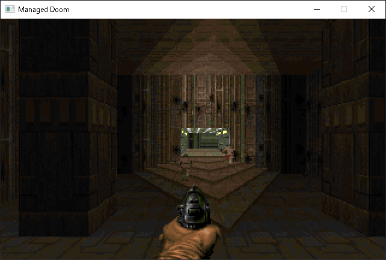
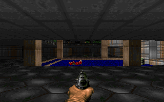
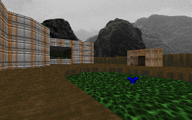
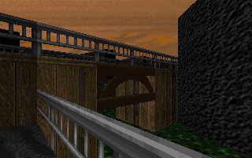
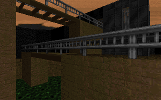
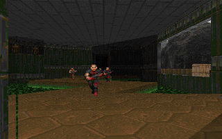

# Managed Doom

The goal of this project is to make a fully functional Doom source port written in C# without unsafe code.  

The rendering engine and game system (player movement, weapons, monster AI and map gimmicks) are almost complete. Now I'm working on the other miscellaneous functionalities, including save / load, menu, config and so on.  

## Screenshots

## Video sample (Doom 2, demo 3)

https://www.youtube.com/watch?v=QntRMbe-ot0  

## Todo

- __Software renderer__  
    * [x] Front-to-back rendering using BSP
    * [x] Wall texture mapping
    * [x] Ceiling / floor texture mapping
    * [x] Transparent textures
    * [x] Diminishing lighting
    * [x] Sky rendering
    * [x] Sprite rendering
    * [x] High resolution rendering
    * [x] Optimization
    * [ ] Fuzz effect
    * [ ] Palette effects

- __Gaming code__
    * [x] Collision detection
    * [x] Player movement
    * [x] Player attack
    * [x] Monster AI
    * [x] Doors and platforms
    * [ ] Animated textures
    * [x] Demo compatibility (All the v1.9 IWAD demos can be played)

- __Audio__
    * [x] Sound
    * [ ] Music

- __Other things__
    * [x] Status bar
    * [x] Automap
    * [x] Title screen
    * [x] Intermission screen
    * [x] Menu screen
    * [x] Save / load
    * [x] Screen melt animation
    * [ ] Config
    * [ ] DeHackEd support

## References

- __The original source code by id Software__  
https://github.com/id-Software/DOOM

- __The Game Engine Black Book: DOOM by Fabien Sanglard__  
If you want to understand the big picture of the rendering process in Doom, buy this one!  
http://fabiensanglard.net/gebbdoom/

- __The Unofficial Doom Specs by Matthew S Fell__  
http://www.gamers.org/dhs/helpdocs/dmsp1666.html

- __Doom Wiki__  
https://doomwiki.org/wiki/Entryway

- __SFML - Simple and Fast Multimedia Library__  
https://www.sfml-dev.org
