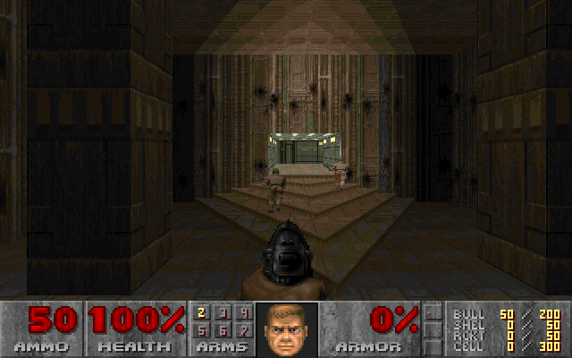
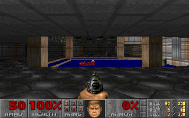
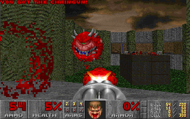
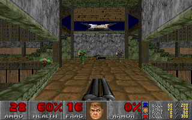
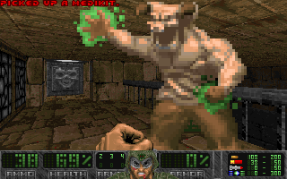
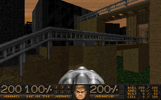
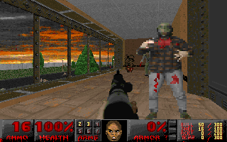
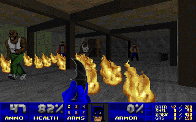

# Managed Doom

Managed Doom is a Doom source port written in C#. The entire code is manually translated from [Linux Doom](https://github.com/id-Software/DOOM) with some effort to make it natural C# code. Most functionalities necessary for single player game are implemented, and now it's in the playable state.

## Screenshots

## Demo video

https://www.youtube.com/watch?v=9_tncwL7qvM  

## Todo

* __Software renderering__  
    - [x] Front-to-back rendering using BSP
    - [x] Wall texture mapping
    - [x] Ceiling / floor texture mapping
    - [x] Transparent textures
    - [x] Diminishing lighting
    - [x] Sky rendering
    - [x] Sprite rendering
    - [x] High resolution rendering
    - [x] Optimization
    - [x] Fuzz effect
    - [x] Palette effects

* __Game__
    - [x] Collision detection
    - [x] Player movement
    - [x] Player attack
    - [x] Monster AI
    - [x] Doors and platforms
    - [x] Animated textures
    - [x] Demo compatibility

* __Audio__
    - [x] Sound
    - [x] Music

* __Misc__
    - [x] Status bar
    - [x] Automap
    - [x] Title screen
    - [x] Intermission screen
    - [x] Menu screen
    - [x] Save / load
    - [x] Screen melt animation
    - [x] Config
    - [x] DeHackEd support

## License

Managed Doom is distributed under the [GPLv2 license](licenses/LICENSE_ManagedDoom.txt).  
Managed Doom uses the following libraries.

* [SFML](https://github.com/SFML/SFML), [CSFML](https://github.com/SFML/CSFML) and [SFML.Net](https://github.com/SFML/SFML.Net) by Laurent Gomila ([zlib license](licenses/LICENSE_SFML.txt))
* [TimGM6mb](https://musescore.org/en/handbook/soundfonts-and-sfz-files#gm_soundfonts) by Tim Brechbill ([GPLv2 license](licenses/LICENSE_TimGM6mb.txt))
* [MeltySynth](https://github.com/sinshu/meltysynth/) ([MIT license](licenses/LICENSE_MeltySynth.txt))

SFML uses the following libraries.

* FreeType ([GPLv2 license](licenses/LICENSE_FreeType.txt))
* libjpeg (public domain)
* stb_image (public domain)
* OpenAL Soft ([LGPL license](licenses/LICENSE_OpenALSoft.txt))
* libogg ([BSD-3 license](licenses/LICENSE_libogg.txt))
* libvorbis ([BSD-3 license](licenses/LICENSE_libvorbis.txt))
* libFLAC ([BSD-3 license](licenses/LICENSE_libFRAC.txt))

## References

* __The Game Engine Black Book: DOOM by Fabien Sanglard__  
If you want to understand the big picture of the rendering process in Doom, buy this one.  
https://fabiensanglard.net/gebbdoom/index.html

* __The Unofficial Doom Specs by Matthew S Fell__  
http://www.gamers.org/dhs/helpdocs/dmsp1666.html

* __MUS File Format Description by Vladimir Arnost__  
https://www.doomworld.com/idgames/docs/editing/mus_form

* __Chocolate Doom by Simon Howard__  
Chocolate Doom is used as the reference of  compatibility tests.  
https://github.com/chocolate-doom/chocolate-doom

* __Crispy Doom by Fabian Greffrath__  
The minimal HUD is imported from Crispy Doom.  
https://github.com/fabiangreffrath/crispy-doom

* __Doom Wiki__  
https://doomwiki.org/wiki/Entryway

* __Eternity Engine DeHackEd / BEX Reference__  
http://eternity.mancubus.net/svn/trunk/docs/dehref.html
